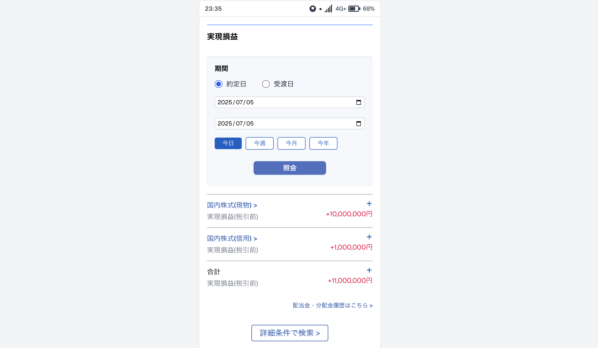

# SAGISHI\_NO\_TEGUCHI

> **警告：このリポジトリは投資詐欺に悪用され得る技術的リスクを啓発するためのデモアプリです。絶対に不正利用しないでください。**

---

## 概要

**SAGISHI\_NO\_TEGUCHI** は、入力した金額をもとに架空の証券口座スマホ画面を生成し、あたかも大きな利益が出ているかのように見せかける Web アプリです。わずか **半日未満** の実装で、実際の証券アプリと見分けがつかないほど高品質な偽装画像を作成できてしまう――そんな“危うさ”を体感し、啓発することを目的としています。

<p align="center">
  
</p>

---

## 主な機能

| 機能                 | 説明                                                     |
| ------------------ | ------------------------------------------------------ |
| ⌨️ 金額入力フォーム        | “現物” と “信用” の利益額（上限 100 億円）を入力すると即時プレビューされます           |
| 📱 証券口座 UI ジェネレーター | 日本の代表的な証券アプリ風 UI を Tailwind CSS で再現                    |
| 🖼️ スクリーンショット保存    | ブラウザのスクショ機能でそのまま画像化可能（本リポジトリでは自動保存機能は提供しません）           |
| ⚡ 超短時間実装           | Next.js 15 (App Router) & TypeScript で **実装時間 ≒ 4 時間** |

---

## デモ

```bash
# ローカルサーバ起動
npm install
npm run dev

# ブラウザでアクセス
http://localhost:3000/
```

1. フォームに希望の金額を入力し `実行`。
2. 画面にモバイルサイズの証券口座 UI がレンダリングされます。
3. ブラウザのスクリーンショット機能で画像を保存すると、まるで本物の取引履歴のような画像が完成します。

> 開発時間が短くても、視覚的に“本物らしい”偽装は容易に作れてしまうことがわかります。

---

## 技術スタック

* **Next.js 15** (App Router, React Server Components)
* **TypeScript**
* **Tailwind CSS**

---

## セキュリティ・倫理的注意

1. **本リポジトリは教育・研究目的専用** です。投資詐欺、SNS での詐称、第三者への誤認誘導など **一切の悪用を禁じます**。
2. 作者は本リポジトリを利用・改変したことによるあらゆる損害・法的責任を負いません。
3. 日本国内外の法令・証券取引関連規則を遵守してください。
4. 偽装画像を見抜く力を養い、詐欺から身を守るための教材としてご活用ください。

---

## コントリビュート

PR や Issue は歓迎ですが、本プロジェクトの趣旨（詐欺防止・啓発）に反する提案はお断りいたします。

